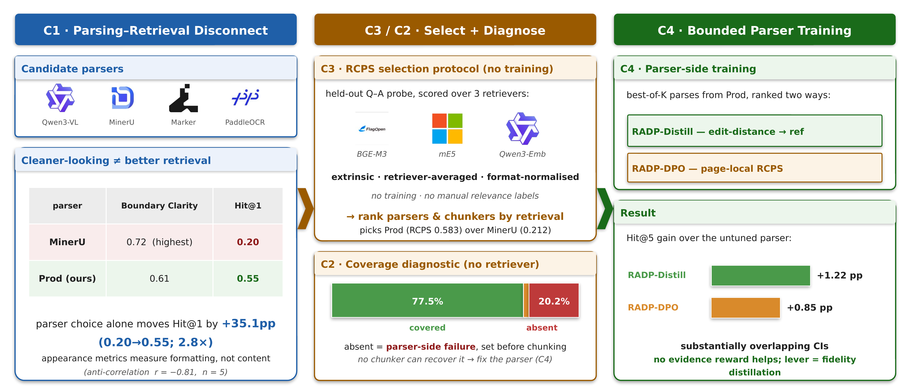
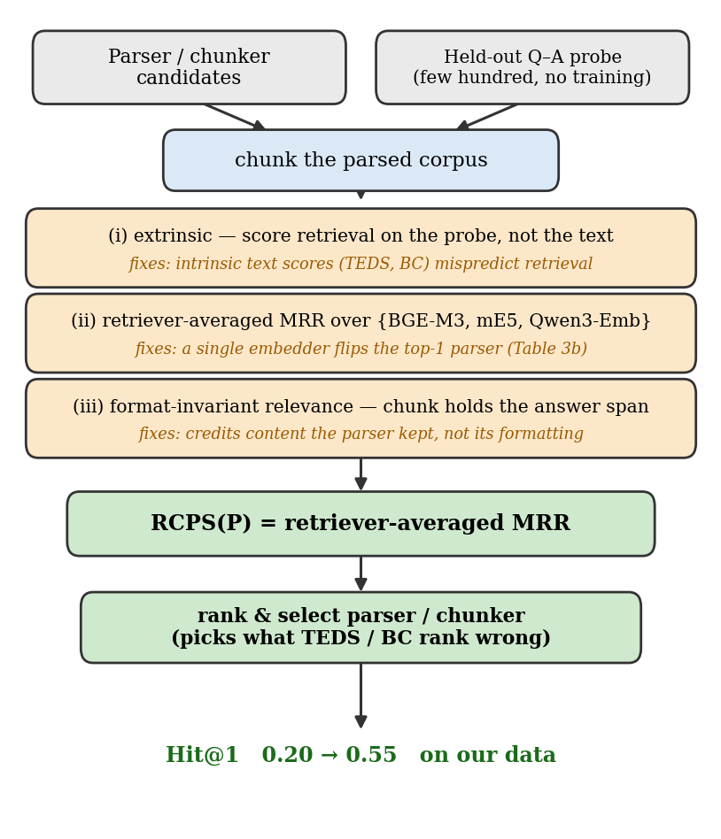
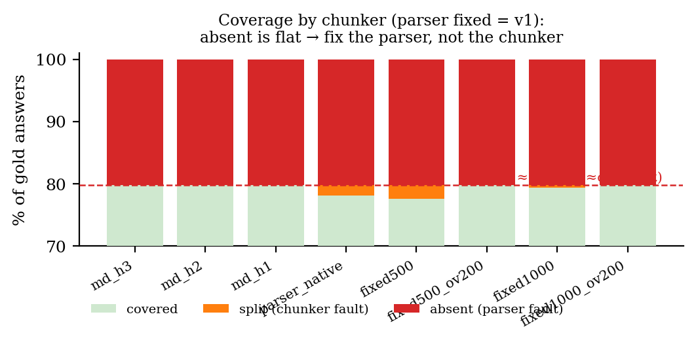
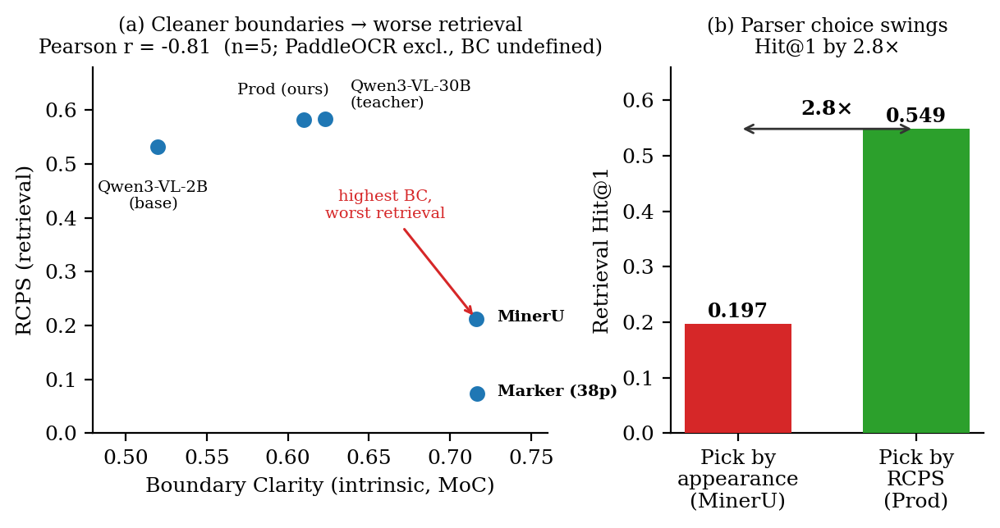

# WigtnOCR-RADP

**RCPS로 검색 기반 선택, coverage로 진단, RADP는 필요할 때만 파서 학습에 사용한다.**

> ✅ **EMNLP 2026 Industry Track · Submission #384 · Accepted**
>
> 🖼️ OpenReview 기록: **Accept (Poster)**. 현재 발표 형식은 잠정적이며 최종 프로그램에서
> oral로 추가 선정될 수 있다.
>
> ⏳ **Camera-ready 마감: 2026년 8월 30일 (AoE)**
>
> 📄 제목: *Retrieval-Conditional Parsing Score (RCPS): Choosing Document Parsers by Retrieval, Not by Appearance* · [camera-ready 작업 PDF](paper/latex/main_camera_ready.pdf)
>
> 📦 Builds on [WigtnOCR v1](https://huggingface.co/Wigtn/Qwen3-VL-2B-WigtnOCR) + [KoGovDoc-Bench](https://huggingface.co/datasets/Wigtn/KoGovDoc-Bench)
>
> 🇺🇸 **[English README](README.md)** · 🧭 연구 정의 [`docs/RESEARCH_DIRECTION.md`](docs/RESEARCH_DIRECTION.md) · 🗓️ 연혁 [`docs/TIMELINE.md`](docs/TIMELINE.md)

---

## 📌 핵심 요약

문서 RAG에서 파서는 출력의 겉모양이 아니라 **실제 검색 결과**로 골라야 한다. RCPS는 같은 held-out Q–A를 각 파서–청커 조합에 적용하고, 세 retriever와 세 검색 깊이의 MRR을 평균해 후보를 비교하는 학습 없는 선택 프로토콜이다.

KoGovDoc-RAG의 완전한 294페이지 출력 5종에서 RCPS는 **0.137–0.584**로 벌어진다. 별도로 감사한 MinerU-on–Prod 비교의 Hit@1 차이는 **+42.6 pp (0.123 → 0.549; 4.47×)**다.

Boundary Clarity(BC)와 RCPS의 상관은 BC가 있는 294페이지 출력 4종에서 **r = −0.74**이고, 38페이지짜리 Marker 결과를 더하면 **r = −0.83 (n = 5)** 다. 둘 다 일반 법칙이 아니라 이 작은 후보군에서 얻은 기술통계다.

핵심 흐름은 **RCPS로 선택 → coverage로 진단 → 필요할 때만 P/C 변경 또는 학습 → 변경된 조합 재평가**다. `covered`이면 기존 조합을 그대로 배포하고, `absent`나 `split` 때문에 parser 또는 chunker를 바꾼 경우에만 같은 RCPS 기준으로 다시 평가한다. 기여는 네 가지다.

- **C1** — 내재적 지표가 retrieval 순위를 잘못 매길 수 있음을 후보군과 source-aligned OHR perturbation으로 확인한다.
- **C2** — **RCPS**(Retrieval-Conditional Parsing Score)로 파서·청커 후보를 학습 없이 선택한다. RCPS는 새 similarity 함수가 아니라 표준 MRR을 일관된 probe·retriever·relevance 규칙으로 묶은 프로토콜이다.
- **C3** — **retriever-free coverage 진단**으로 parser-output exact-span absence와 chunk-boundary split을 구분한다. Prod에서는 각각 **20.2%**와 최대 **2.3%**다.
- **C4** — 파서 학습 결과의 범위를 측정한다. 73페이지 pilot은 사전 목표를 충족하지 못했고, 별도의 2,036-Q–A OHR compatibility subset에서 R2/R3/Distill의 Prod 대비 Hit@5 차이는 **+0.95/+1.15/+1.36 pp**다. Distill과 DPO의 직접 비교 구간은 모두 0을 포함한다.

현재 저장소에는 frozen **663-Q–A probe**, 242개 evidence page의 169/73 split, RCPS 구현,
Prod·PaddleOCR·MinerU-on의 294페이지 출력과 선별된 결과 산출물이 있다. source-page mapping,
일부 parser 출력과 checkpoint처럼 아직 제공되지 않은 항목은 아래에서 따로 구분한다.

<p align="center">
  
</p>

*Figure 1 — RCPS 워크플로.* 294페이지 / 663 Q–A 고정 frame에서 모든 parser–chunker 후보를
평가한다. RCPS로 `P* + C*`를 1차 선택한 뒤 coverage가 covered, absent, split을 구분한다. Parser나
chunker를 변경했다면 최종 배포 전에 같은 RCPS 프로토콜로 다시 평가한다.
([벡터 PDF](paper/figures/fig_overview.pdf) · [편집 가능한 PPTX](paper/figures/fig_overview_camera_ready.pptx))

---

## 💡 동기 — 파싱 품질과 검색 성능은 같지 않다

> **감사된 deployment 비교에서 MinerU-on은 BC 0.713이지만 Hit@1은 0.123이다.** Prod는 BC 0.610, Hit@1 0.549다. 제출 당시 MinerU-off 출력은 별도 진단으로만 남기며, 두 MinerU 실행은 software·retrieval 환경도 다르므로 off→on 차이를 table recognition의 인과 효과로 해석하지 않는다.

OHR-Bench, EnterpriseDocBench와 동시기 연구도 parsing 품질과 retrieval이 어긋날 수 있음을 보고한다. 이 논문의 좁은 차별점은 그 관찰을 **재사용 가능한 parser–chunker 선택 프로토콜**과 **absence/split 진단**, 그리고 **변경된 configuration의 재평가**로 연결한 데 있다. 파서 학습은 보조 연구이며 C1–C3에는 학습이 필요 없다.

---

## 🧱 기여

| | 기여 | 헤드라인 결과 |
|---|---|---|
| **C1** | intrinsic parsing 지표와 retrieval 순위의 불일치를 후보군 안에서 측정하고, source-aligned OHR perturbation으로 두 지표가 다르게 반응함을 보인다. | BC가 있는 294페이지 출력 4종의 BC↔RCPS **r = −0.74**(기술통계); 별도 MinerU-on–Prod 비교 **Hit@1 +42.6 pp** |
| **C2** | retriever 평균·format-normalised relevance·고정 Q–A probe를 사용하는 **RCPS 프로토콜**. | 완전한 294페이지 파서 5종 **0.137–0.584**; Prod 고정 청커 4종 **0.535–0.593** |
| **C3** | reference span을 *covered / split / absent*로 나누는 **retriever-free coverage 진단**. | **20.2% normalised exact-span absent** vs 최대 **2.3% split** |
| **C4** | 평가 frame별로 파서 학습의 작고 불확실한 차이를 보고한다. retrieval-reward 학습은 matched Distill control과 분리되지 않는다. | 73페이지 pilot 목표 미달; OHR compatibility subset에서 R2/R3/Distill Hit@5 **+0.95/+1.15/+1.36 pp** vs Prod |

---

## 🔬 방법

### RCPS — Retrieval-Conditional Parsing Score (C2)

파서를 *출력이 얼마나 깨끗한가*가 아니라 *downstream 검색이 그 출력으로 무엇을 하는가*로 점수 매긴다. RCPS는 **새 유사도 함수가 아니라** 보통의 retrieval MRR을 세 가지 선택으로 감싼 **프로토콜**이다.

- **extrinsic:** 텍스트 자체가 아니라 held-out Q–A probe로 채점한다.
- **retriever 평균:** 배포 retriever가 미정일 때 여러 embedder에 걸쳐 비교한다.
- **format-normalised relevance:** whitespace·Markdown 정규화 후 answer span을 포함하는 chunk만 relevant로 판정한다.

```
RCPS(P, C; D, R, K) = (1 / |R||K|) · Σ_{r∈R} Σ_{k∈K} MRR@k(r, C(P), D)
```

여기서 `P`는 parser, `C`는 chunker, `D`는 고정 Q–A probe다. `R = {BGE-M3, multilingual-e5-large, Qwen3-Embedding-8B}`, `K = {1, 5, 10}`을 사용한다. chunk는 출처 페이지가 reference page와 같고, 공백·Markdown을 정규화한 뒤 reference answer span을 포함할 때만 relevant다. 평가는 학습 없이 실행한다. 구현: [`src/wigtnocr_radp/evaluation/`](src/wigtnocr_radp/evaluation/).

각 질의에서 MRR@`k`는 첫 relevant chunk가 `j ≤ k`위에 나오면 `1/j`, 상위 `k`개 안에 없으면 0을 부여한 뒤 질의 전체에서 평균한 값이다.

<p align="center">
  
</p>

*Figure 2 — RCPS 평가 프로토콜.* 모든 후보는 같은 probe, retriever·검색 깊이 명세, reference-page +
normalised-span relevance rule을 사용한다. 표준 MRR을 평균하며 평가 자체에는 학습이 필요 없다.
([벡터 PDF](paper/figures/fig_rcps_protocol.pdf))

### Coverage 진단 — 파서 vs 청커 (C3)

RCPS는 파서+청커+retriever를 함께 채점하므로 낮은 점수만으로 어느 layer를 먼저 살펴야 하는지 알기 어렵다. 파서 출력을 고정하고 청커만 바꿔, 정규화한 reference span을 **covered**, **split**(페이지 출력에는 있지만 chunk 사이에 나뉨 — overlap으로 회복 가능), **absent**(정규화한 파서 출력에 exact match가 없어 re-chunking만으로 같은 span을 복원할 수 없음)로 분류한다. absent는 실제 내용 누락일 수도, 표면형 차이일 수도 있으므로 case-level 검토로 구분해야 한다. 코드: [`scripts/evaluation/coverage_diagnostic.py`](scripts/evaluation/coverage_diagnostic.py).

<p align="center">
  
</p>

*Figure 3 — Prod 고정 coverage 진단.* pre-chunking exact-span no-match는 **20.2%**로 유지되고,
chunker를 바꿀 때 달라지는 것은 split이며 8개 chunker에서 최대 **2.3%**다.
([벡터 PDF](paper/figures/fig_coverage.pdf))

### 파서측 학습 — 시도와 한계 (C4)

coverage 진단이 파서 출력을 가리킬 때 시험한 학습 접근과 control은 다음과 같다.

- **RADP-aux** *(hidden-state 보조손실).* `L_total = L_parse + λ·L_contrast`로 답-span hidden state와 frozen BGE-M3 임베딩을 정렬한다. 73페이지 pilot에서 사전 목표를 충족하지 못했다.
- **RADP-DPO** *(discrete-output retrieval-reward DPO).* 별도의 2,667페이지 training corpus에서 Prod 후보 parse를 샘플하고 page-local BGE-M3 MRR로 preference pair를 만든다. 학습 시 `π_θ`는 LoRA on, `π_ref`는 LoRA off다. R2는 R1 checkpoint에서 두 번째 preference round를 `beta = 0.1`로 시작하고, R3는 후보 pool과 hard negative를 확장한다. 원본 R2 실행 로그로 확인한 portable config와 source-log hash는 [`docs/provenance/RADP_DPO_R2_EXECUTED_CONFIG.md`](docs/provenance/RADP_DPO_R2_EXECUTED_CONFIG.md)에 기록했다.
- **RADP-Distill** *(fidelity-based control).* 후보를 page-local BGE-M3 MRR retrieval reward 대신 reference Markdown과의 edit-distance로 순위한다. 동일한 2,036-Q–A frame에서 Hit@5는 Prod보다 **+1.36 pp**이며, Distill−R2와 Distill−R3의 직접 비교 신뢰구간은 모두 0을 포함한다.
- **SimPO** *(reference-free control).* 242페이지 분석의 point estimate는 음수지만 모든 신뢰구간이 0을 포함하며, 어떤 최적화 차이가 원인인지는 이 실험만으로 분리하지 못한다.

---

## 🧪 실험

### 평가 프레임

분모가 다른 평가를 섞지 않도록 다섯 frame을 따로 사용한다.

| Frame | Index / 표본 | 용도 |
|---|---|---|
| KoGovDoc-RAG selection | **294페이지**(KoGov 229 + arXiv 65), 663 Q–A | C1–C3. 663개 답의 evidence는 242페이지에 있고, 나머지 52페이지는 Q–A가 없는 distractor다. |
| KoGovDoc-RAG training/mechanism | **242페이지**, 같은 663 Q–A | DPO·SimPO와 mechanism의 탐색적 pooled 분석. 73페이지 pilot과 같은 독립 holdout이 아니다. |
| KoGovDoc-RAG pilot | **73페이지, 202 Q–A** | RADP-aux·RADP-DPO를 사전 성공 기준으로 확인한 held-out pilot. |
| OHR Law–Manual | **1,043 Q–A** | C1 semantic-noise perturbation. 3개 benchmark output + 12개 종속 변종이며 15개 독립 파서가 아니다. |
| OHR compatibility | **6개 domain, 2,036 Q–A** | C4의 post-audit R2/R3/Distill 비교. full OHR-Bench v2 rerun이 아니다. |

KoGovDoc-RAG의 pseudo-reference는 수동 de-noise한 Qwen3-VL-30B 출력이고 Q–A는 `gpt-5.4-2026-03-05`로 생성했다. 별도의 LLM 기반 점검은 층화 표본 100개 중 94개를 accept했지만, 전체 reference나 Q–A가 인간 검증된 것은 아니다. 학습 preference는 평가셋과 page-disjoint인 **2,667페이지 / 6,164 Q–A** corpus에서만 만든다.

**Prod**는 한국 문서 파싱용으로 fine-tune한 Qwen3-VL-2B다. 학습은 LoRA(`r=8`, `α=32`)를 사용한다. RCPS는 세 retriever × 세 검색 깊이를 평균하고, delta의 신뢰구간은 별도 표기가 없으면 Q–A-level paired percentile bootstrap으로 계산한다.

### C1 — 경계가 선명해도 검색 순위는 낮을 수 있다

완전한 294페이지 출력 5종의 deployment 비교는 다음과 같다. MinerU-on은 별도로 감사한 table-enabled configuration이다.

| 완전한 294페이지 deployment 비교 | BC | CS | RCPS | Hit@1 |
|---|:---:|:---:|:---:|:---:|
| Qwen3-VL-30B (teacher) | 0.623 | 3.38 | **0.584** | 0.545 |
| **Prod (ours, 2B)** | 0.610 | 3.07 | 0.583 | **0.549** |
| Qwen3-VL-2B (base) | 0.520 | 3.74 | 0.532 | 0.500 |
| PaddleOCR | — | 3.46 | 0.140 | 0.125 |
| MinerU-on | **0.713** | — | 0.137 | 0.123 |

BC가 정의된 완전한 294페이지 deployment configuration 4종(Qwen3-VL-30B, Prod, Qwen3-VL-2B, MinerU-on)의 BC와 RCPS 상관은 **r = −0.74**다. 38페이지 Marker를 추가하면 **r = −0.83 (n = 5)**다. 둘 다 작은 후보군의 기술통계다. PaddleOCR에는 측정된 BC가 없으며 Marker는 complete-output 결과로 취급하지 않는다.

| 제출본/부분 출력 진단 | 범위 | BC | CS | RCPS | Hit@1 |
|---|:---:|:---:|:---:|:---:|:---:|
| MinerU-off (제출본) | 294페이지 | 0.716 | 2.81 | 0.212 | 0.197 |
| Marker | 38페이지 | **0.717** | 3.41 | 0.073 | 0.068 |

MinerU-on과 MinerU-off는 table handling 외에도 software·retrieval 환경이 다르므로 두 점수의 차이를 table recognition의 인과 효과로 해석하지 않는다. BC는 Boundary Clarity(높을수록 좋음), CS는 Chunk Stickiness(낮을수록 좋음)다.

<p align="center">
  
</p>

*Figure 4 — intrinsic parsing 품질은 retrieval 후보를 잘못 순위화할 수 있다.* (a)는 MinerU-on을
포함한 294페이지 deployment configuration의 기술적 BC–RCPS 진단이고, (b)는 MinerU-on과 Prod의
Hit@1을 비교한다. MinerU-off는 별도 제출본 진단이며 table recognition의 인과 ablation이 아니다.
([벡터 PDF](paper/figures/fig_disconnect.pdf))

### C1 — 정렬된 OHR Law–Manual 노이즈 실험

정렬된 Law–Manual subset에서 semantic noise는 검색을 낮추지만 BC는 일관되게 반응하지 않는다. clean→severe에서 MinerU RCPS는 **0.595 → 0.265**로 떨어지는 동안 BC는 **0.657 → 0.631**로 비단조 변화한다. Qwen2.5-VL RCPS는 **0.545 → 0.497**로 떨어지지만 BC는 약 **0.563**에 머문다.

clean GOT 출력은 없다. mild→severe에서 GOT RCPS는 **0.461 → 0.298**로 떨어지고 BC는 **0.586 → 0.624**로 오른다. 15개 행의 합산 상관 **r = −0.35**는 같은 family 안 변종들이 종속적이므로 기술통계로만 본다. 이 한정된 subset으로 더 넓은 도메인 일반성을 주장하지 않는다.

### C2 — RCPS로 파서와 청커 후보를 순위화한다

| Chunker | RCPS | Hit@1 | MRR@10 |
|---|:---:|:---:|:---:|
| md-h3 | **0.593** | 0.556 | 0.613 |
| parser_native | 0.583 | 0.549 | 0.602 |
| LumberChunker | 0.557 | 0.514 | 0.580 |
| fixed500 | 0.535 | 0.491 | 0.560 |

*KoGov 청킹 grid (663 Q–A, Prod 출력, 3-retriever RCPS 평균).* 제출 당시 grid(MinerU-off 포함)의
tracked aggregate를 감사한 결과, MRR@{1,5,10} 평균 대신 3-retriever **MRR@10만 사용해도**
완전한 294페이지 파서 5개와 청커 4개의 순위가
그대로 유지된다($\tau=1.0$). 반면 retriever 평균을 빼고 BGE-M3 하나만 쓰면 **거의 동률인 30B–Prod의
순서만** 바뀐다(Prod 1위; full RCPS는 30B teacher 1위). 나머지 순서는 같아 Kendall $\tau=0.80$이다.
배포 retriever가 고정돼 있다면 그 retriever로 선택하고, 아직 미정이거나 후보가 근접할 때 평균을
hedge로 쓴다. format-sensitive 비교에 필요한 ranked chunk 목록은 저장되지 않아 해당 ablation은 보고하지 않는다.

별도의 3-parser end-to-end 확인에서 Prod의 judged answer accuracy는 **72.5%**로 MinerU-on
**23.8%**, PaddleOCR **20.5%**보다 높다. 다만 RCPS에서는 거의 동률인 하위 두 parser의 순서가
뒤집히며, 같은 GPT-5.4 checkpoint가 답을 생성하고 판정한다. 따라서 full ranking 검증이 아니라
top choice 확인으로만 해석한다.

### C3 — coverage 진단이 출력 부재와 chunk 경계를 구분

Prod 출력(294페이지, 663 Q–A, **retriever 없음**)에서 134/663 reference span(**20.2%**)은 정규화한 page output에 exact match가 없다. chunk boundary에 걸리는 span은 최대 15/663(**2.3%**)다. absent 비율은 **8개 chunker 전반에서 일정**하므로 re-chunking만으로 같은 exact span을 복원할 수 없다. 다만 `absent`는 matcher의 운영상 라벨이지 semantic omission의 증명은 아니다.

라벨 견고성도 따로 확인했다. GPT-5.4는 Prod의 exact-match-absent case 중 **56%**를 recoverable surface artefact로 재분류했다. Q–A도 GPT 계열 모델이 생성했으므로 이 judge는 생성 과정과 독립적이지 않다.

별도의 parser-masked 100-case 층화 표본을 두 저자가 독립 판정했을 때 사전 일치도는 **κ=0.615, 81/100**이었다. adjudication 뒤 retrieval-unusable 비율은 MinerU-on **42/50(84.0%)**, Prod **12/30(40.0%)**, PaddleOCR **19/20(95.0%)**였다. 표본 비율과 MinerU configuration이 서로 달라 모집단 수준의 재현으로 해석하지 않는다. Sampling manifest, 두 평가 파일, 19건의 adjudication 기록은 저장소 scorer로 재검증했다. 원본은 저자 전용 감사 패키지에 보관하고 공개본에는 aggregate 결과만 보고한다.

### C4 — 파서측 학습은 pilot 목표를 충족하지 못했다

73페이지 / 202-Q–A held-out pilot에서 RADP-aux와 RADP-DPO는 모두 사전 목표(최소 +5 RCPS points이면서 95% CI 하한 > 0)를 충족하지 못했다. 이후 242페이지 pooled 분석에서 DPO R1–R3의 parser-native Hit@5 point estimate는 Prod보다 **+1.96–+2.11 pp**지만 모든 양측 신뢰구간이 0을 포함한다. 이 분석은 여러 설정을 본 뒤 선택한 탐색적 결과이며 73페이지와 독립인 새 holdout이 아니다.

별도의 OHR 결과는 benchmark release 혼합을 감사한 뒤 다시 계산했다. legacy `notes` 오류 223건과 현 parser bundle에 evidence page가 없는 5건을 제외한 6-domain compatibility subset 결과는 다음과 같다.

| Δ vs Prod (pp) | Hit@1 | Hit@5 | Hit@10 | MRR@10 | nDCG@5 |
|---|:---:|:---:|:---:|:---:|:---:|
| RADP-DPO R2 (retrieval reward) | +0.59 | +0.95 | +0.90 | +0.78 | +0.82 |
| RADP-DPO R3 (hard-negative) | +1.46 | +1.15 | +0.90 | +1.30 | +1.28 |
| RADP-Distill (edit-distance control) | +0.98 | +1.36 | +1.47 | +1.12 | +1.16 |

*post-audit legacy compatibility subset, n=2,036, 3-retriever macro, Q–A-level paired bootstrap 1,000회(seed 42). Hit@5 95% CI는 R2 **[+0.33,+1.54]**, R3 **[+0.31,+2.05]**, Distill **[+0.43,+2.29]**다. Distill−R2는 **+0.41 pp [−0.43,+1.26]**, Distill−R3는 **+0.21 pp [−0.61,+1.05]**로 두 구간 모두 0을 포함한다. audit 뒤 정의한 subset이므로 기존 confirmatory analysis나 full OHR-Bench v2 평가로 취급하지 않는다.*

242페이지 분석에서 SimPO의 Hit@5 point estimate는 md-h3 **−0.85 pp**, parser-native **−0.70 pp**이며 두 신뢰구간 모두 0을 포함한다. 동일 OHR frame의 직접 비교에서는 retrieval-reward pair selection이 edit-distance pair selection보다 낫다는 증거가 없다.

### C4 — fidelity·boundary 측정만으로 학습 메커니즘을 확정할 수 없다

| Variant | BC ↑ | TextNED ↓ vs reference |
|---|:---:|:---:|
| Prod (ref) | 0.630 | 0.240 |
| RADP-DPO R2 | 0.647 | **0.163** |
| RADP-DPO R3 | — | 0.185 |
| RADP-aux λ=0.1 | 0.652 | 0.423 |

*현재 가능한 242페이지 사후 측정이다. DPO checkpoint들은 Prod보다 TextNED가 낮고 Hit@5 point estimate가 높지만, TextNED가 checkpoint 순서를 설명하지는 못한다. R3 BC와 불확실성 추정치가 없어 fidelity나 boundary change를 원인으로 결론낼 수 없다.*

---

## 🚀 배포 플레이북

1. **후보 파서·청커를 RCPS로 먼저 비교한다.** BC나 edit distance만으로 downstream 순위를 대신하지 않는다. 배포 retriever가 정해졌다면 그 retriever를 쓰고, 미정이거나 근접 후보를 비교할 때 여러 retriever 평균을 쓴다.
2. **coverage로 낮은 검색 점수의 위치를 진단한다.** *split*이 많으면 chunk size·overlap을 조정한다. *absent*가 많으면 실제 내용 누락인지 표면형 차이인지 case를 확인한 뒤 파서를 바꾼다.
3. **선택과 진단 뒤에만 파서 학습을 고려한다.** 73페이지 pilot은 목표에 미달했고, 감사된 OHR compatibility 결과도 Prod 대비 약 1 Hit@5 point 차이다. 서로 다른 평가 frame의 42.6-point parser-selection 차이와 직접 비교하지 않는다.
4. **원인 주장은 추가 근거가 있을 때만 한다.** DPO checkpoint의 낮은 TextNED는 사후 동반 관계다. 현재 결과만으로 fidelity 향상이 retrieval 차이를 일으켰다거나 boundary mechanism이 작동했다고 결론낼 수 없다.

---

## 📂 저장소 구조

```
.
├── configs/                  # 실험 config (YAML)
├── src/wigtnocr_radp/
│   ├── qa_generation/        # Q-A 생성
│   ├── evaluation/           # RCPS, chunker, retriever, coverage, Boundary Clarity, bootstrap CI
│   └── training/             # RADP-aux(contrastive) · RADP-DPO · SimPO (LoRA-toggle ref)
├── scripts/
│   ├── training/             # 후보 생성, preference / edit-distance pair, DPO/Distill/SimPO 파이프라인
│   ├── evaluation/           # baseline_grid, chunking_grid, coverage_diagnostic, rcps_protocol_ablation, OHR 체인
│   └── figures/              # 논문 그림 생성기 (disconnect, RCPS protocol, overview PPTX)
├── experiments/              # RADP-Distill 학습·평가 harness
├── paper/                    # 제출 동결본 + camera-ready 작업 LaTeX + figures
├── data/KoGovDoc-RAG/        # frozen 663-Q–A probe와 242 evidence-page split
├── docs/                     # RESEARCH_DIRECTION · TIMELINE · ROADMAP · plans/ · literature_review/
├── output/                   # 선별된 결과 JSON; 아래 산출물 상태 참고
└── tests/
```

## ⚡ 로컬 코드 점검 (Linux/WSL CUDA 환경)

```bash
uv sync --extra dev
uv run pytest
uv run python scripts/evaluation/coverage_diagnostic.py --out_dir /tmp/rcps-coverage-check
```

이 명령들은 `pyproject.toml`과 `uv.lock`에 고정된 Linux/WSL CUDA 12.8 의존성 환경을 전제로 한다.
깨끗한 macOS/CPU 설치 경로는 아직 packaging·검증되지 않았다. 마지막 coverage 계산 자체는 CPU 기반이며,
기본 Prod 294페이지 출력과 663 Q–A는 tracked이다. 다만 source-page mapping
`data/KoGovDoc-Bench/val.jsonl`은 gitignore되어 있어 현재 명령만으로는 fresh-clone 재현이 완결되지 않는다.
동등한 로컬 입력이 있다면 `--parser_dir`와 `--val_jsonl`로 경로를 지정할 수 있다.
이 명령들은 논문 실험 전체의 **fresh-clone 재현**을 의미하지 않는다.
전체 파이프라인은 외부 데이터·일부 parser 출력·embedding cache·checkpoint에 아직 의존한다. portable
end-to-end 실행법과 남은 공개 산출물은 아래의 camera-ready 작업 항목이다.

> **그림 정본 안내:** camera-ready 정본은 `paper/figures/fig_overview.pdf`,
> `fig_rcps_protocol.pdf`, `fig_coverage.pdf`, `fig_disconnect.pdf`이며, 이 README에는 대응하는 PNG preview를
> 표시한다. Figure 1의 편집 정본은 `paper/figures/fig_overview_camera_ready.pptx`이며 RCPS 배지는 C2,
> coverage 배지는 C3이다. `scripts/figures/make_fig_overview.py`는 비정본 대체 렌더러이므로 승인된
> PPTX 기반 PDF를 덮어쓰면 안 된다.

---

## 👥 저자 (OpenReview 및 camera-ready 순서)

**WigtnOCR v1**(Qwen3-VL-2B 문서 파싱 fine-tuning)의 후속 연구.

1. Sang-Woo Son
2. Hyeong-seob Kim
3. Hyeonsang Kim
4. Hyun-woo Cho
5. Jinmo Kim

저자 명단과 순서는 제출 당시 그대로 유지한다. Industry Track chairs가 이 순서를 바꾸지 않고
Hyeong-seob Kim을 교신저자로 지정해도 된다고 서면 확인했다. 카메라레디 PDF에는 ACL 템플릿의
`Correspondence: harrison@wigtn.com` 표기를 사용한다. 소속과 나머지 이메일은 확인된 metadata만
추후 반영한다.

---

## 📦 산출물 및 재현성 상태

### 현재 저장소에 있음

- **KoGovDoc-RAG 평가 파일** — 663 Q–A와 242개 evidence page의 frozen 169/73 split. 논문의 selection
  frame은 이 242쪽과 Q–A가 없는 distractor 52쪽을 함께 index해 총 294페이지(**KoGov 229 + arXiv 65**)를 사용한다.
  원본 source-page corpus와 portable mapping은 아직 packaging되지 않았다.
  별도의 LLM-assisted 100-pair Q–A 품질 점검 표본과 aggregate 94/100 결과도 있다. 이 표본의 빈
  `verification` 필드는 인간 라벨이 아니다.
- **RCPS 레퍼런스 구현** — [`src/wigtnocr_radp/evaluation/`](src/wigtnocr_radp/evaluation/).
- **선별된 평가 산출물** — tracked aggregate grid, full-grid와 audited training의 aligned per-Q–A 배열,
  Prod·PaddleOCR·MinerU-on의 294페이지 출력과 관련 결과 JSON. 동일 294페이지 full-grid 감사는
  [`fullgrid_perqa_294p.json`](output/results/fullgrid_perqa_294p.json)과 parser/chunker
  [`ranking-stability`](output/results/rank_stability_parser_rcps_294p.json) 결과를 포함한다.
  663개 중 500개를 뽑는 고정-seed 1,000회에서 Prod는 Base와 모든 OCR parser보다 100% 높았고,
  전체 chunker 순서는 96.1% 유지됐다. Raw matching은 두 pool의 순서를 바꾸지 않으면서 RCPS를
  0.024–0.041 낮췄다.
- **정렬된 OHR 감사 artifact** — Law–Manual 1,043 Q–A C1 결과, aligned RADP-Distill per-QA 배열, strict 2,036-Q–A legacy compatibility subset의 deterministic derivation. 구 7-domain 산출물은 provenance 용도로 남아 있지만 camera-ready 근거로는 유효하지 않다.
- **100-case absent-label 인간 검증의 aggregate 결과** — 원고에 κ=0.615, raw 81/100과 adjudication 후 parser별 비율을 기록했다. Sampling·평가·adjudication 원본은 재검증을 마쳤으며 저자 전용 감사 패키지에 보관한다.
- **Camera-ready Figure 1–4** — vector PDF와 README용 PNG preview를 저장했고, Figure 1은 최종 editable
  PPTX도 포함한다. 합본 PDF는 모든 font embedded 및 Type 3 font 0개를 확인했다.

### Camera-ready 전까지 남은 공개 항목

- `val_####` Q–A page ID를 tracked parser-output filename에 연결하는 source-page mapping
  (`data/KoGovDoc-Bench/val.jsonl`) 또는 이에 해당하는 portable manifest.
- MinerU **table-OFF**, Qwen3-VL-30B, Qwen3-VL-2B-base 파서 출력과 정확한 rerun 명령.
- current/quarantine workflow의 clean-machine 검증. 논문은 full OHR-Bench v2 결과를 주장하지 않으며, 향후 full-v2 실험에는 공식 v2 Q–A와 새 parser·retrieval run이 필요하다. legacy 7-domain/combined-CI/OHR-TextNED artifact는 이미 quarantine manifest로 분리했다.
- complete BC/CS mechanism data와 aligned uncertainty estimate.
- RADP-Distill, RADP-aux, RADP-DPO, SimPO의 complete executed-config/log provenance와 모델 체크포인트. R2 실행 config(`beta = 0.1`)는 원본 로그로 확인을 마쳤다.
- 외부 데이터, parser 출력, embedding cache, checkpoint 획득, 머신 종속 실행 가정을 포함한
  **portable fresh-clone end-to-end 재현 경로**.

## 📄 License & Citation

저장소 코드는 **MIT License**로 공개한다. 타사 데이터셋과 모델 자산에는 각각의 원 라이선스와
이용 조건이 적용된다.

```bibtex
@inproceedings{son2026rcps,
  title     = {Retrieval-Conditional Parsing Score (RCPS): Choosing Document Parsers by Retrieval, Not by Appearance},
  author    = {Son, Sang-Woo and Kim, Hyeong-seob and Kim, Hyeonsang and Cho, Hyun-woo and Kim, Jinmo},
  booktitle = {Proceedings of EMNLP 2026 (Industry Track)},
  year      = {2026},
  note      = {Accepted; camera-ready pending}
}
```
