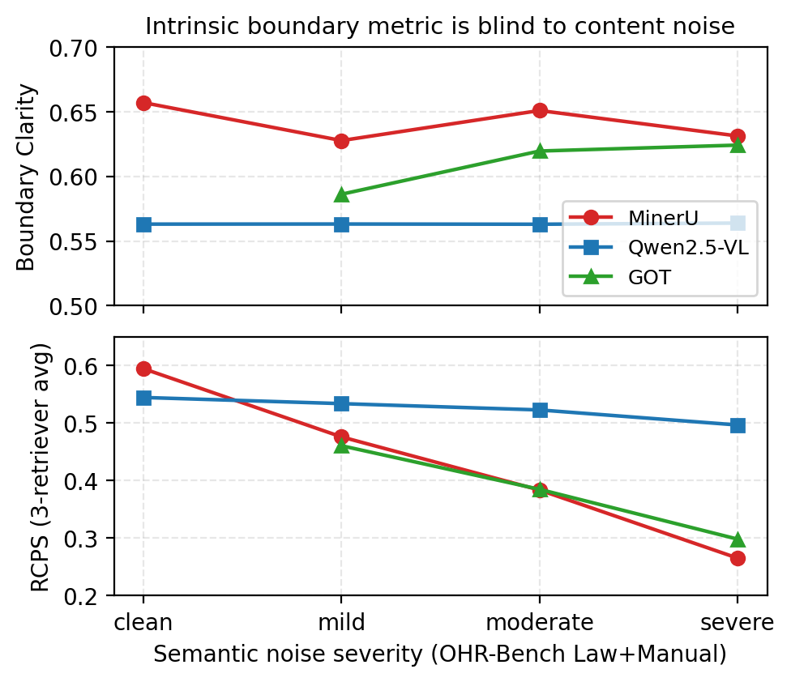

# WigtnOCR-RADP

**Retrieval-Aware Document Parsing (RADP) — *보기에* 가장 깨끗한 파서가 검색에 가장 좋은 파서는 아니다.**

> 🎯 **EMNLP 2026 Industry Track** 투고 · 논문 초안 **v0.8** (2026-06-07) · 마감 2026-06-16
>
> 📄 제목: *Retrieval-Conditional Parsing Score (RCPS): Choosing Document Parsers by Retrieval, Not by Appearance*
>
> 📦 Builds on [WigtnOCR v1](https://huggingface.co/Wigtn/Qwen3-VL-2B-WigtnOCR) + [KoGovDoc-Bench](https://huggingface.co/datasets/Wigtn/KoGovDoc-Bench)
>
> 🇺🇸 **[English README](README.md)** · 🧭 연구 정의 [`docs/RESEARCH_DIRECTION.md`](docs/RESEARCH_DIRECTION.md) · 🗓️ 연혁 [`docs/TIMELINE.md`](docs/TIMELINE.md)

---

## 📌 한 줄 요약

RAG에 쓰이는 문서 파서는 보통 **내재적(intrinsic) "깨끗함" 지표**(edit distance·Boundary Clarity)로 고른다 — 깨끗한 출력이 검색도 잘 될 거라는 가정. **틀렸다.** 한국 정부문서(6 parser × 3 retriever × 663 Q–A)에서 MoC Boundary Clarity는 검색과 **Pearson r = −0.81 (n = 5)** 로 역상관 — BC 1위(MinerU)가 검색은 꼴찌고, 파서를 *외형*이 아니라 *검색*으로 고르면 **Hit@1이 +35.1 pp (0.197 → 0.549; 2.8×)** 바뀐다.

**헤드라인은 학습이 아니라 "선택(selection)"이다.** 기여는 네 가지:

- **C1** — parsing↔retrieval **disconnect**와 그 메커니즘 진단 (내재적 지표는 *내용*이 아니라 *형식*만 본다).
- **C2** — **retriever-free coverage 진단**: 결함이 어느 layer인지 국소화. 답의 **20.2%** 가 파서 출력에 *absent*(파서 결함), 8개 chunker 전반에서 일정.
- **C3** — **RCPS** (Retrieval-Conditional Parsing Score): 학습 없이 검색 기반으로 파서·청커를 고르는 **프로토콜**. ablation으로 single-embedder MRR이 아님을 보임.
- **C4** — 파서측 학습의 **경계(bounded)** 지도: best-of-K **fidelity distillation (RADP-Distill)** 이 **OHR-Bench Hit@5 +1.22 pp**, matched control과 CI가 크게 겹쳐 **retrieval reward가 fidelity 기반 선택보다 낫다는 증거 없음**. hidden-state aux는 sub-threshold, reference-free SimPO는 negative.

**KoGovDoc-RAG**(한국 정부문서 294페이지 / 663 Q–A) + RCPS 레퍼런스 구현 + RADP-Distill 체크포인트를 공개한다.

---

## 💡 동기 — Parsing 품질 ≠ Retrieval 성능

> **BC 1위 파서(MinerU, 0.72)가 retrieval Hit@1 0.20으로 6개 중 꼴찌.** 가장 깨끗해 보이는 파서가 가장 검색이 안 된다.

같은 방향을 OHR-Bench(ICCV 2025), EnterpriseDocBench(2026), When Good OCR Is Not Enough(2026)가 영어·엔터프라이즈에서 독립 보고했다. **선행 연구는 진단에 머물거나 다른 layer(chunking → retriever → generator)를 학습한다. L1 파서 자체를 검색 신호로 *고르거나* *학습*한 사례는 없다 — 그게 우리 niche.**

---

## 🧱 Contributions

| | 기여 | 헤드라인 결과 |
|---|---|---|
| **C1** | parsing↔retrieval **disconnect**와 메커니즘. 영어 OHR-Bench에 semantic-noise를 주입하면 BC는 평평한데 검색은 붕괴 — 내재적 지표는 *형식*만 보고 *내용*을 못 본다. | BC↔RCPS **r = −0.81** (n=5); 파서 선택만으로 **Hit@1 +35.1 pp** (0.197→0.549; 2.8×) |
| **C2** | **retriever-free coverage 진단** — 답을 *covered / split(청커 결함) / absent(파서 결함)* 로 분류. retriever 돌리기 *전에* 쓰는 규칙. | **20.2% absent** vs ≤2.3% split, 8개 chunker 전반 일정 ⇒ 파서를 고쳐라 |
| **C3** | **RCPS** — retriever-평균·format-normalised·held-out Q–A **프로토콜**, 학습 없이 파서·청커 선택. ablation: single-embedder MRR이 **아님**. | retriever-평균이 top 파서를 뒤집음; naive MRR 대비 **Kendall τ = 0.87** |
| **C4** | 파서측 학습의 **경계** 지도. best-of-K **fidelity distillation**이 lever, retrieval-reward 장치는 그 위에 아무것도 더하지 않음. RADP-aux sub-threshold, SimPO negative. | **RADP-Distill +1.22 pp** OHR-Bench Hit@5 [+0.35, +2.15] (n=2,264) |

---

## 🔬 Method

### RCPS — Retrieval-Conditional Parsing Score (C3)

파서를 *출력이 얼마나 깨끗한가*가 아니라 *downstream 검색이 그 출력으로 무엇을 하는가*로 점수 매긴다. RCPS는 **새 유사도 함수가 아니라** 보통의 retrieval MRR을 세 가지 선택으로 감싼 **프로토콜**이다: **(i) extrinsic** (텍스트가 아니라 held-out Q–A probe로 채점), **(ii) retriever-평균** (여러 embedder 평균 — 프로덕션 embedder 하나에 순위가 좌우되지 않게), **(iii) format-normalised** relevance (whitespace/markdown 정규화 후 chunk 텍스트가 답 span을 포함하면 relevant).

```
RCPS(P, D, R, K) = (1 / |R||K|) · Σ_{r∈R} Σ_{k∈K}  MRR@k( r, chunks_P(D), {qᵢ} )
```

`R = {BGE-M3, multilingual-e5-large, Qwen3-Embedding-8B}`, `K = {1, 5, 10}`. chunk이 **relevant**한 것은 그 출처 페이지가 답의 페이지와 일치하고 gold span이 chunk의 substring일 때(공백·markdown 무시 정규화). 수백 개 held-out Q–A로 **학습 없이** 실행. 구현: [`src/wigtnocr_radp/evaluation/`](src/wigtnocr_radp/evaluation/).

### Coverage 진단 — 파서 vs 청커 (C2)

RCPS는 파서+청커+retriever를 함께 채점하므로 낮은 점수가 *어느 layer* 탓인지 말해주지 않는다. 파서 출력을 고정하고 청커만 바꿔, 각 gold 답을 **covered**, **split**(경계가 답을 잘라버림 — 청커 결함, overlap으로 회복 가능), **absent**(파서 출력에 아예 없음 — 파서 결함, 어떤 청킹으로도 회복 불가)로 분류. 규칙: *absent가 지배적이면 파서를, split이 지배적이면 청커를 고쳐라.* 코드: [`scripts/evaluation/coverage_diagnostic.py`](scripts/evaluation/coverage_diagnostic.py).

### 파서측 학습 — 되는 것과 안 되는 것 (C4)

coverage 진단이 파서를 가리키면, 두 가지 자연스러운 방향으로 파서측 학습을 시험한다.

- **RADP-aux** *(hidden-state 보조손실 — sub-threshold).* `L_total = L_parse + λ·L_contrast` (파서의 답-span pooled hidden state와 frozen BGE-M3 임베딩 간 InfoNCE). 신호가 배포 markdown엔 diffuse gradient backflow로만 도달 — **threshold 미달**.
- **RADP-DPO** *(discrete-output retrieval-reward DPO).* 프로덕션 파서에서 K개 parse를 샘플 → page-local RCPS로 채점 → preference pair 구성 → **LoRA-toggle 레퍼런스**로 학습 (`π_θ`=LoRA on, `π_ref`=LoRA off — 가속기 하나, 모델 복제 없음). reward를 **R1 → R2 → R3** 마일스톤으로 sharpening.
- **RADP-Distill** *(reward-agnostic control — 권장 lever).* **동일한** best-of-K 파이프라인이되, 후보를 page-local RCPS 대신 **GT markdown과의 edit-distance**로 순위. RADP-DPO와 CI가 크게 겹침 ⇒ **retrieval reward가 더 낫다는 증거 없음**, lever는 fidelity distillation.
- **SimPO** *(reference-free control — negative).* 레퍼런스 정책 제거 시 전 cell에서 음수 — reference anchoring이 load-bearing임을 확인.

---

## 🧪 Experiments

### Setup

- **KoGovDoc-RAG** — 한국 정부문서 294페이지 / 663 Q–A (`gpt-5.4` 생성, LLM-as-judge 94/100 accept). DPO/SimPO + 메커니즘은 통합 **242페이지 / 663-Q–A** fold; RADP-aux는 73페이지 held-out fold; +train Q–A 6,164개(2,667페이지 Prod train).
- **OHR-Bench** — cross-domain 영어 복제, 7 도메인, **2,264 verbatim-answerable Q–A**; 15 parser-output 변종(real 3 + formatting-noise 3 + semantic-noise 9)이 C1 메커니즘 구동.
- **모델** — **Prod** = 한국 문서 파싱용 fine-tune된 Qwen3-VL-2B; LoRA (r=8, α=32). 모든 RCPS는 3 retriever × 3 cutoff; delta는 paired percentile bootstrap.

### C1 — disconnect (한국 정부문서)

BC가 RCPS와 **Pearson r = −0.81 (n = 5**, BC 미정의인 PaddleOCR 제외)로 역상관. BC가 가장 깨끗한 파서(MinerU·Marker; BC ≈ 0.72)가 검색 꼴찌. Chunk Stickiness도 무의미(CS↔RCPS r = +0.26).

| Parser | BC | CS | RCPS | Hit@1 |
|---|:---:|:---:|:---:|:---:|
| Qwen3-VL-30B (teacher) | 0.623 | 3.38 | **0.584** | 0.545 |
| **Prod (ours, 2B)** | 0.610 | 3.07 | 0.583 | 0.549 |
| Qwen3-VL-2B (base) | 0.520 | 3.74 | 0.532 | 0.500 |
| MinerU | 0.716 | 2.81 | 0.212 | 0.197 |
| PaddleOCR | — | 3.46 | 0.140 | 0.125 |
| Marker (38p) | **0.717** | 3.41 | 0.073 | 0.068 |

*KoGov parser grid (Appendix D). BC vs RCPS, r = −0.81 (n = 5, PaddleOCR 제외; Marker도 빼면 n = 4, r = −0.74).*

### C1 — 메커니즘 (cross-domain, OHR-Bench)

각 semantic-noise family 안에서 **BC는 거의 안 움직이는데 RCPS는 붕괴** — MinerU RCPS 0.50 → 0.24 (−51%, BC는 0.71–0.74 평평), GOT 0.38 → 0.26, Qwen2.5-VL은 noise-robust(0.47 → 0.43, −8%). 내재적 경계 지표는 검색이 의존하는 *내용*이 아니라 *형식*만 본다. (cross-variant 합산 scalar는 문서 mix에 민감 — 모든 도메인에서 재현되는 per-family 메커니즘을 robust한 결과로 보고.)



### C2 — coverage 진단이 결함을 파서로 국소화

Prod 출력(294페이지, 663 Q–A, **retriever 없음**)에서 답의 **20.2%가 absent**, split은 최대 **2.3%**, absent 비율이 **8개 chunker 전반에서 일정** — 파서 결함이 보여야 할 boundary-independence 그대로. 답 다섯 중 하나가 애초에 생성되지 않으니 re-chunking으로 회복 불가: 결함은 **파서** 문제이고, 이것이 C4의 파서측 개입을 정당화한다.

### C3 — RCPS는 청커를 구분하며, single-embedder MRR이 아니다

| Chunker | RCPS | Hit@1 | MRR@10 |
|---|:---:|:---:|:---:|
| md-h3 | **0.593** | 0.556 | 0.613 |
| parser_native | 0.583 | 0.549 | 0.602 |
| LumberChunker | 0.557 | 0.514 | 0.580 |
| fixed500 | 0.535 | 0.491 | 0.560 |

*KoGov 청킹 grid (663 Q–A, Prod 출력, 3-retriever RCPS 평균).* **Ablation:** retriever-평균을 빼고 단일 embedder(BGE-M3)로 채점하면 **top 파서가 뒤집힘**(Prod 1위; full RCPS는 30B teacher 1위), format-invariance는 점수만 옮기고 순서는 유지. 순위 불일치(**Kendall τ = 0.87**)가 RCPS가 relabel된 MRR이 아니라 프로토콜임을 입증.

### C4 — 파서측 학습: 경계 있는, reward-agnostic lever

사전 지정 확증 시험은 cross-domain **OHR-Bench** 복제(학습 신호·평가 지표·문서 언어가 상호 disjoint). **RADP-Distill**(edit-distance distillation, **retrieval reward 없음**)이 헤드라인이자 권장 레시피:

| Δ vs Prod (pp) | Hit@1 | Hit@5 | Hit@10 | MRR@10 | nDCG@5 |
|---|:---:|:---:|:---:|:---:|:---:|
| **RADP-Distill** (headline) | **+0.88** | **+1.22** | **+1.32** | **+1.01** | **+1.05** |
| RADP-DPO R2 (retrieval reward) | +0.53 | +0.85 | +0.81 | +0.70 | +0.74 |
| RADP-DPO R3 (hard-negative) | +1.31 | +1.03 | +0.81 | +1.17 | +1.15 |

*OHR-Bench cross-domain, 3-retriever macro, 1k paired bootstrap. Hit@5 양측 유의(95% CI: Distill [+0.35, +2.15], R2 [+0.35, +1.43], R3 [+0.24, +1.84]). RADP-Distill이 primary metric Hit@5에서 RADP-DPO를 매칭/리드 ⇒ retrieval reward는 fidelity distillation 위에 아무것도 더하지 않음.*

탐색적 KoGov fold(242페이지, n = 663)에서 RADP-DPO 마일스톤은 Hit@5 +1.96 ~ +2.11 pp(P[Δ>0] ≈ 0.90, 이 fold 크기에선 양측 비유의); RADP-Distill은 **+2.61 pp**(P = 0.95). SimPO는 일관되게 음수(−0.7 ~ −1.7 pp).

### C4 — 메커니즘: 학습은 청킹이 아니라 텍스트 fidelity를 조인다

| Variant | BC ↑ | CS ↓ | TextNED ↓ vs GT |
|---|:---:|:---:|:---:|
| Prod (ref) | 0.630 | 0.474 | 0.240 |
| **RADP-Distill** | 0.641 | — | **0.158** |
| RADP-DPO R2 | 0.647 | 0.476 | **0.163** |
| RADP-DPO R3 | 0.656 | 0.485 | 0.185 |
| RADP-aux λ=0.1 | 0.652 | 0.484 | 0.423 |

*Chunk-level 메커니즘(242페이지 fold). RADP-Distill이 TextNED-vs-GT를 가장 크게 낮춤(0.240 → 0.158)면서 **청킹 시그니처는 불변**(BC ≈ 0.63, CS ≈ 0.474). 이득은 *어떻게* chunk를 나누느냐가 아니라 *무엇을* 파싱하느냐에서 옴 — C1의 내재적-지표 둔감함을 학습 쪽에서 본 동일한 사실. RADP-aux는 반대로 TextNED를 *증가*(hidden-state 목적이 surface 텍스트를 훼손).*

---

## 🚀 배포 플레이북

1. **파서는 내재적 지표가 아니라 RCPS로 평가하라.** Boundary Clarity(나아가 edit distance)는 downstream retriever가 뒤집는 순서로 파서를 매길 수 있다. 수백 개 held-out Q–A를 학습 없이 채점하는 것이 0.20 → 0.55 Hit@1 결정. *가장 레버리지 큰 교훈.*
2. **coverage 진단을 먼저 돌려라.** *absent*가 지배적이면 파서를, *split*이 지배적이면 청커를 고쳐라.
3. **파서를 학습한다면 discrete 출력을 깨끗한 GT 텍스트로 distill하라.** cross-domain ≈ +1 pp Hit@5 기대, 채점에 안 쓴 retriever에서 가장 큼. retrieval reward는 이 control 대비 이득이 없었음; hidden-state aux와 reference-free SimPO는 피하라(둘 다 실패).
4. **텍스트 정밀도가 검색을 좌우하는 곳에 예산을 써라.** 이득은 factoid 질의(+3 pp)에 집중되고 tabular엔 대체로 중립 — layout 무거운 스택은 청커·embedder를 보라.

---

## 📂 저장소 구조

```
.
├── configs/                  # 실험 config (YAML)
├── src/wigtnocr_radp/
│   ├── qa_generation/        # Q-A 생성
│   ├── evaluation/           # RCPS, chunker, retriever, coverage, Boundary Clarity, bootstrap CI
│   └── training/             # RADP-aux(contrastive) · RADP-DPO · RADP-Distill · SimPO (LoRA-toggle ref)
├── scripts/
│   ├── training/             # 후보 생성, preference / edit-distance pair, DPO/Distill/SimPO 파이프라인
│   ├── evaluation/           # baseline_grid, chunking_grid, coverage_diagnostic, rcps_protocol_ablation, OHR 체인
│   └── figures/              # 논문 그림 생성기 (disconnect, RCPS protocol, overview PPTX)
├── experiments/              # arm_b_textned_distill = RADP-Distill 런
├── paper/                    # EMNLP 2026 초안 v0.8 (paper.md) + LaTeX (paper/latex) + figures
├── data/KoGovDoc-RAG/        # 663 Q-A (frozen, gitignored)
├── docs/                     # RESEARCH_DIRECTION · TIMELINE · ROADMAP · plans/ · literature_review/
├── output/                   # 결과·체크포인트 (gitignored, GPU 서버)
└── tests/
```

## ⚡ Quick start

```bash
uv sync                                   # 의존성 (extras: eval / train / data)
cp .env.example .env                      # OPENAI_API_KEY 설정
hf download Wigtn/KoGovDoc-Bench --repo-type dataset --local-dir data/KoGovDoc-Bench

# Coverage 진단 (GPU 불필요, CPU 수초) — C2 결과, 가장 먼저 재현 가능
uv run python scripts/evaluation/coverage_diagnostic.py
```

---

## 👥 저자 (WIGTN)

**WigtnOCR v1**(Qwen3-VL-2B 문서 파싱 fine-tuning)의 후속 연구.

| 저자 (OpenReview) | 이메일 | 기여 (CRediT) |
|------|-------|--------------|
| **Hyeong-seob Kim**\* | harrison@wigtn.com | Conceptualization, Methodology, Project administration |
| **Sang-woo Son**\* | sangwoo@wigtn.com | Software, Validation, Investigation |

> \* **공동 1저자 (equal contribution).**

---

## 📦 공개 산출물

- **KoGovDoc-RAG** — 한국 정부문서 294페이지 / 663 Q–A.
- **RCPS 레퍼런스 구현** — [`src/wigtnocr_radp/evaluation/`](src/wigtnocr_radp/evaluation/).
- **RADP-Distill 체크포인트** — 권장 배포 lever (best-of-K, edit-distance 순위, retrieval reward 없음).
- **RADP-aux (λ ∈ {0, 0.1, 0.3, 0.5}) + RADP-DPO (R1–R3) + SimPO 체크포인트** — negative / 통제 비교용 재현 공개.
- **OHR-Bench cross-domain 결과 + 메커니즘 분석** (12 systems × 242페이지의 BC / CS / TextNED).

## 📄 License & Citation

**MIT License**.

```bibtex
@inproceedings{kim2026rcps,
  title     = {Retrieval-Conditional Parsing Score (RCPS): Choosing Document Parsers by Retrieval, Not by Appearance},
  author    = {Kim, Hyeong-seob and Son, Sang-woo},
  booktitle = {Proceedings of EMNLP 2026 (Industry Track)},
  year      = {2026},
  note      = {To appear}
}
```
